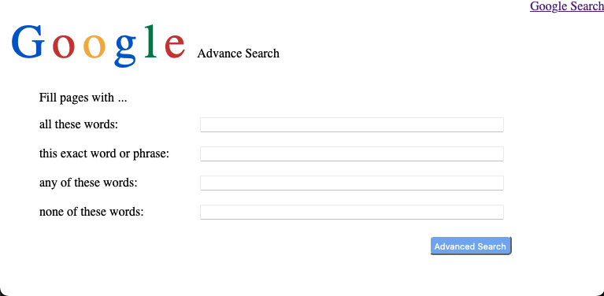

# Project 0 - Search

This project is a simple clone of Google's search functionality, consisting of three main pages: **Google Search**, **Google Image Search**, and **Google Advanced Search**.  

**Google Search**:  


**Google Image Search**:  


**Google Advanced Search**:  


-----

#### Load Webpage

```bash
cd search
open index.html
```

-----

[Link](https://cs50.harvard.edu/web/2020/projects/0/search/) to detailed project description.