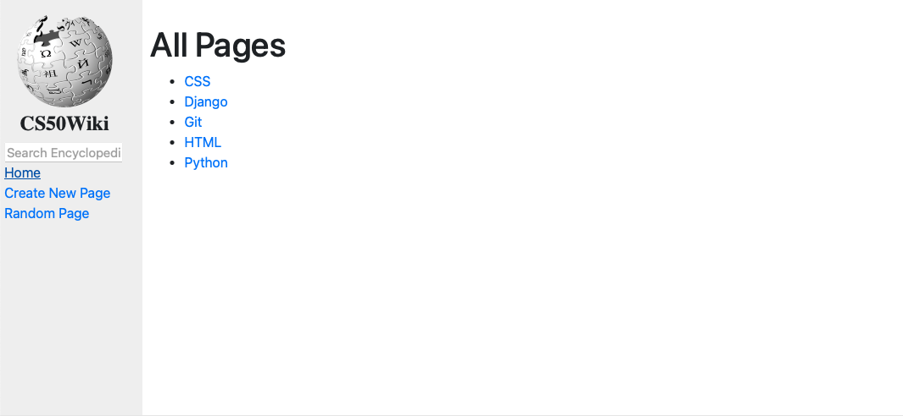
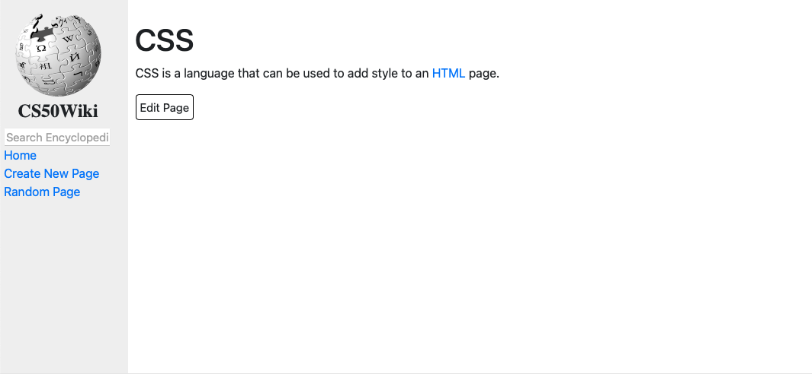
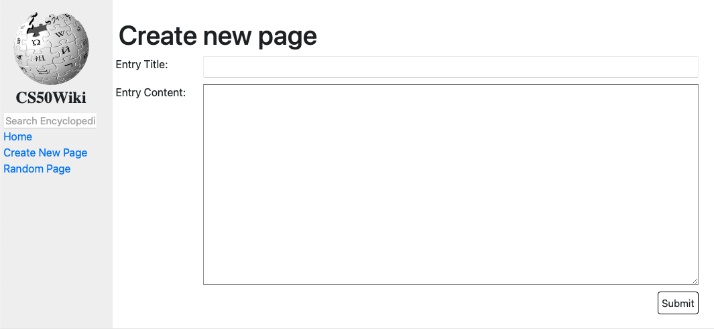

# Project 1 - Wiki

This project is a Django-based online encyclopedia that stores entries in Markdown format, rendering them as HTML pages for users to view and edit.  

**Default Page**:  


**Example Content: CSS**:  


**New/Edit Page**:  


-----

#### Load Webpage

```bash
cd wiki
python3 manage.py runserver
```

-----

[Link](https://cs50.harvard.edu/web/2020/projects/1/wiki/) to detailed project description.