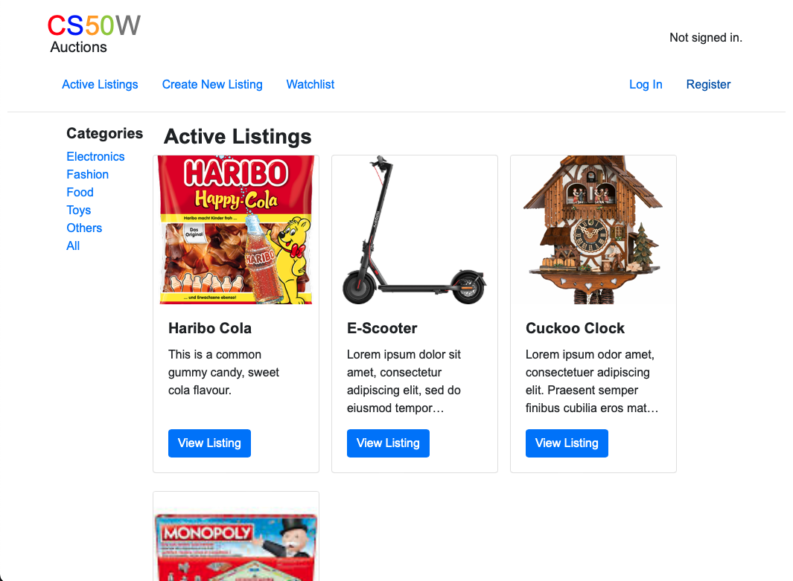
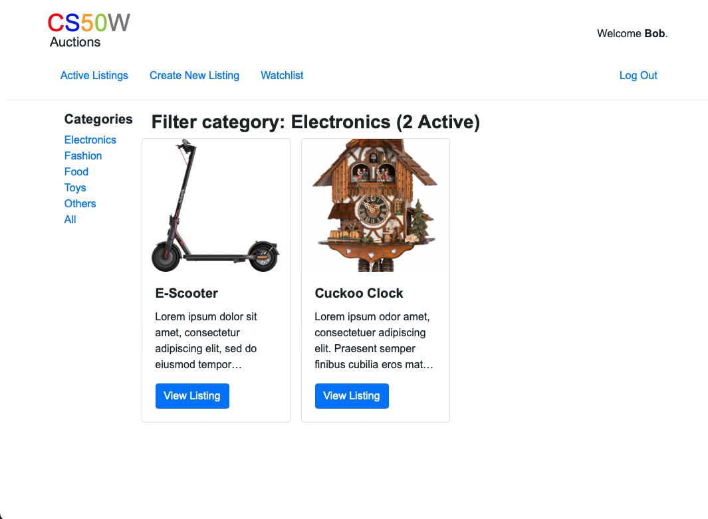
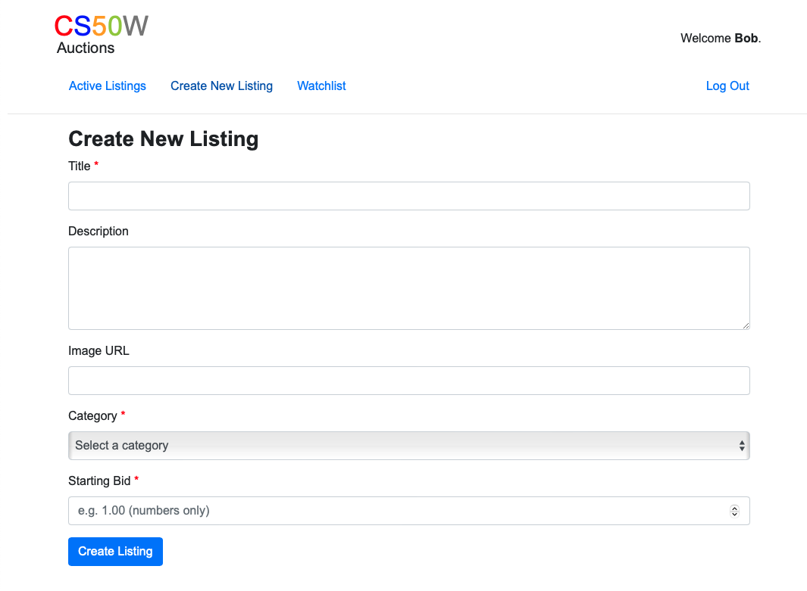
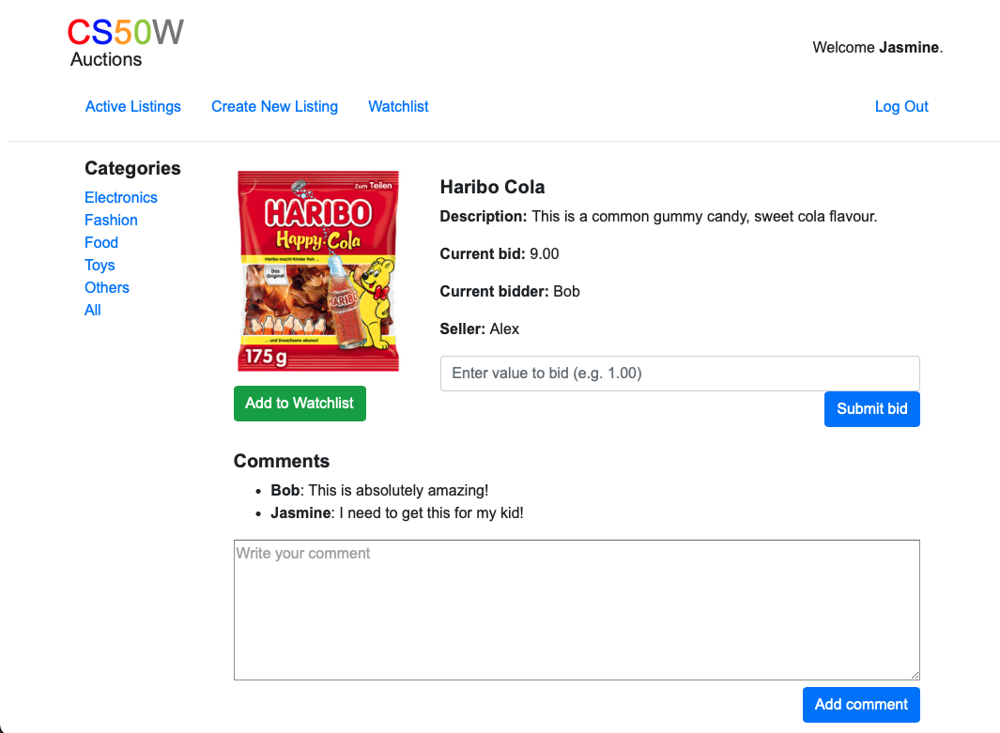
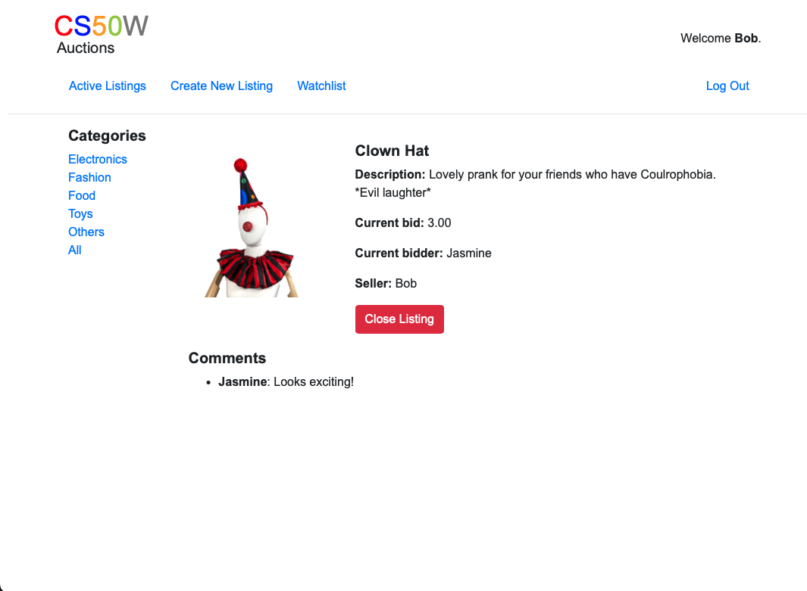
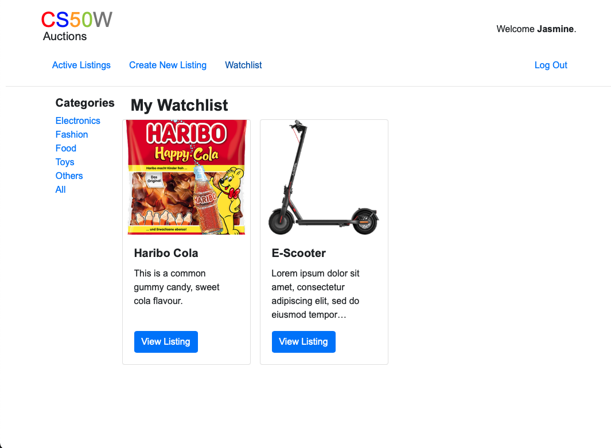
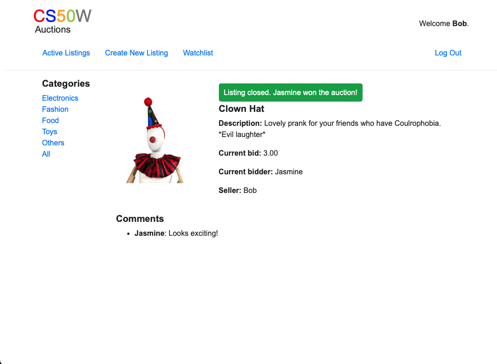

# Project 2 - Commerce

This project involves creating an eBay-like e-commerce auction site using Django, where users can post listings, place bids, comment, add items to a watchlist, and manage auctions, with functionalities for viewing active listings, categories, and user-specific watchlists.  

**Default Page**:  


**Filter Page**:  


**Create Listing**:  


**Listing from User and Owner**:  



**Watchlist**:  


**Closed Listing**:  


-----

#### Load Webpage

```bash
cd commerce
python3 manage.py runserver
```

-----

[Link](https://cs50.harvard.edu/web/2020/projects/2/commerce/) to detailed project description.